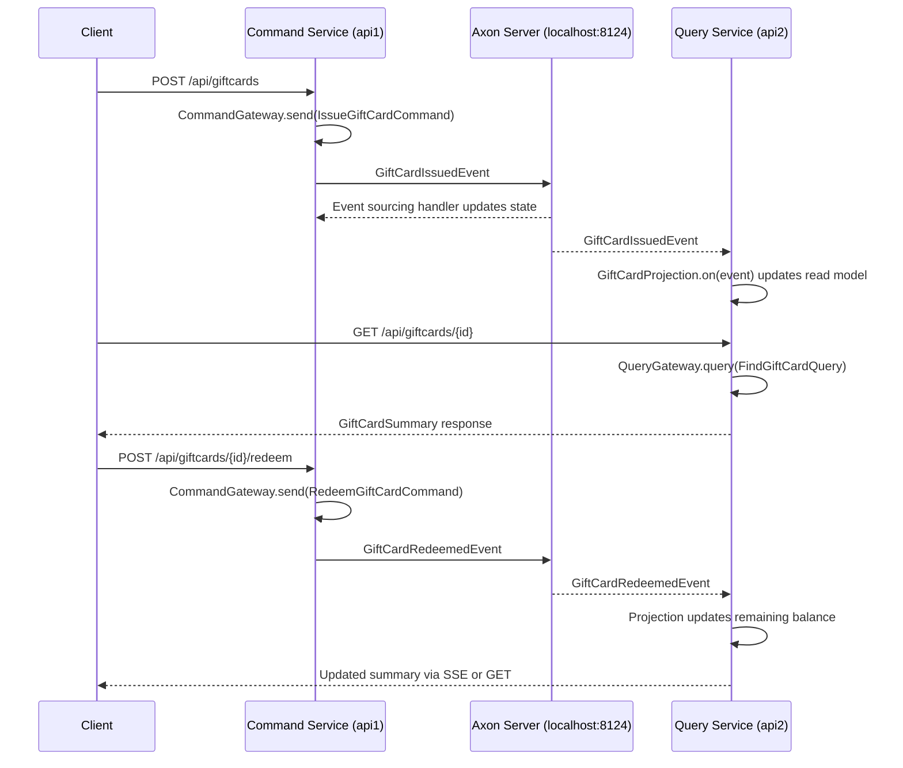

# Axoniq Platform Quickstart

This simple GiftCard application demonstrates the core concepts of the Axoniq Platform, including Command Handling,
Event Sourcing, and Projections. It is built using the Axon Framework and Spring Boot.

## Prerequisites
- Java 17 or higher
- Maven 3.6 or higher
- Docker (for running the Axon Server)
- An IDE like IntelliJ IDEA or Eclipse (optional)

## Getting Started

Run docker-compose to start Axon Server:

```bash
docker-compose up -d
```

Now, you can run the application using Maven:

```bash
mvn spring-boot:run
```

Alternatively, you can run the application from your IDE by running the `QuickstartApplication` class.

## Using the Application
You can interact with the application via the basic UI available on [http://localhost:8080](http://localhost:8080).
The events are stored in Axon Server, which you can access at [http://localhost:8024](http://localhost:8024).

Your application and Axon Server will both connect to the Axoniq Platform. You can monitor and manage your application from there: [https://monitor.axoniq.io/workspace/6fbd767b/env/6fbd767b-0](https://monitor.axoniq.io/workspace/6fbd767b/env/6fbd767b-0).

## Command/Query Flow at a Glance

1. A client issues `POST /api/giftcards` (or `/api/giftcards/{id}/redeem`) against **api1**. The Spring `GiftCardController` (`api1/src/main/java/io/axoniq/quickstart/giftcard/web/GiftCardController.java`) forwards the request to Axon Framework's `CommandGateway`.
2. `CommandGateway.send(...)` routes the command to the appropriate handler. `GiftCardAggregate` (`api1/src/main/java/io/axoniq/quickstart/giftcard/aggregate/GiftCardAggregate.java`) validates the request and calls `AggregateLifecycle.apply(...)`, which emits a domain event.
3. Axon Server (running locally on `localhost:8124`) stores the event and publishes it to any subscribers. The aggregate's own `@EventSourcingHandler` updates in-memory state, while **api2** receives the same event through Axon's event bus.
4. **api2** processes the event in `GiftCardProjection` (`api2/src/main/java/io/axoniq/quickstart/giftcard/query/GiftCardProjection.java`), updating its read model and notifying any active subscription queries.
5. Read requests (`GET /api/giftcards` or `/{id}`) are sent to **api2**. Its `GiftCardController` uses the Axon `QueryGateway` to retrieve the latest projection data and returns it to the caller. Server-sent event (SSE) endpoints keep clients updated in real time.

When both services are started with `make start-all`, you can watch the log streams via `make logs-all` to observe the command-side "Issuing..." and query-side "Projection stored..." messages that confirm cross-service coordination.

### Sequence Overview



## Useful resources

You can access a lot of resources through the [Axoniq Platform](https://platform.axoniq.io/). This includes:

- Extensive Documentation
- Axoniq Academy with free courses
- AI-powered Development Agent to create your applications faster
- Community Forum to ask questions and share knowledge
- Monitor your applications
- And much more!
